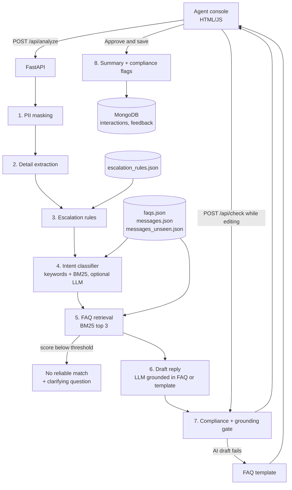

# Architecture and design decisions

## Key decisions

| Decision | Why | Trade-off |
|---|---|---|
| Escalation is rule-based, not AI | A fraud or lost-card hand-off must be predictable and explainable. Rules show the exact phrase that triggered them. | New wording needs new patterns (the held-out set showed this); the intent classifier acts as a second safety net (fraud or card-loss intent always escalates). |
| BM25 retrieval in pure Python instead of a vector database | 15 FAQs do not need embeddings; BM25 is instant, offline and its scores are explainable. | Weaker on synonyms; the FAQ `keywords` field compensates, and the LLM can cross-check intent. |
| LLM is optional with automatic fallback | Hackathon Wi-Fi and API quotas are unreliable. The demo must never break. | Template drafts are less natural than LLM drafts. |
| Drafts use only the retrieved FAQ | Prevents invented fees, timelines or promises. | Questions outside the FAQs get a clarifying question, not an answer. |
| PII masked before anything else | Nothing sensitive reaches logs, storage or an external AI model. | Masking is regex-based, so unusual formats could be missed. |
| Tone changes wording only | Requirement 6.5: tone must not change the approved guidance. Unit-tested. | Less flexibility in phrasing. |
| MongoDB with JSON fallback | Uses the required stack, but a stopped MongoDB service does not stop the demo. | Two code paths in storage. |
| Human approval before anything is saved | Requirement: no autonomous customer communication. | One extra click for the agent. |
| Escalation scenarios are a JSON config file (v1.1) | The use case asks for "configured escalation scenarios". Operations can add a rule, team and linked FAQ without touching code. | Regex patterns still need someone careful to write them. |
| Deterministic compliance gate on every draft and every edit (v1.1) | An LLM can drift from the FAQ even with a strict prompt, and an agent can make a mistake under pressure. A rule check that compares figures against the FAQ text catches both, and explains why. | Can flag a legitimate figure the agent types that is not in the FAQ; the agent can still save after confirming, and the flag is recorded. |
| Held-out test set (v1.1) | Scoring only on the set the rules were tuned on overstates accuracy. The held-out set exposed missed urgent wordings, which we fixed. | Once looked at, a held-out set is no longer blind; add fresh messages for each new round. |
